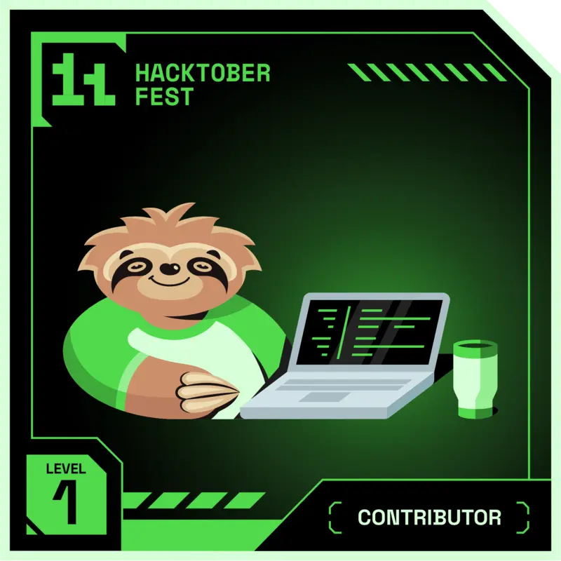
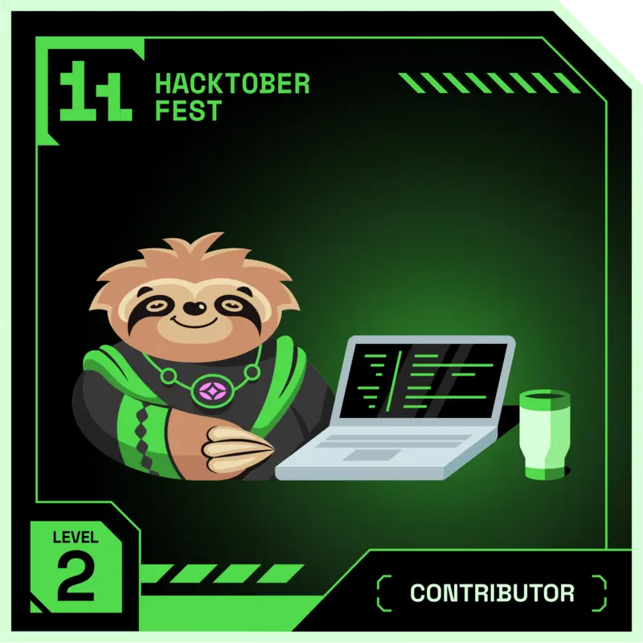
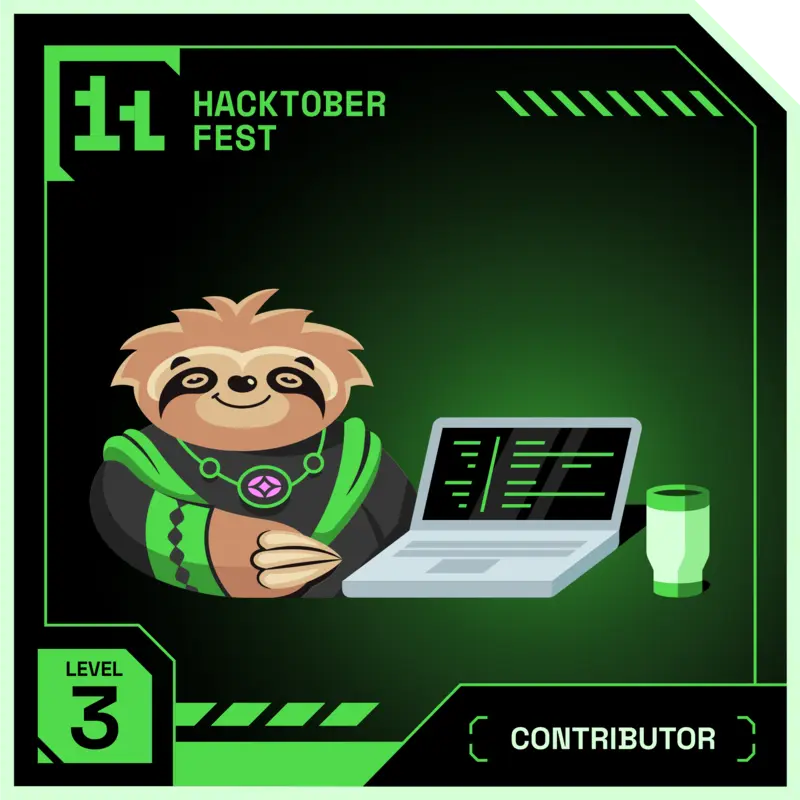
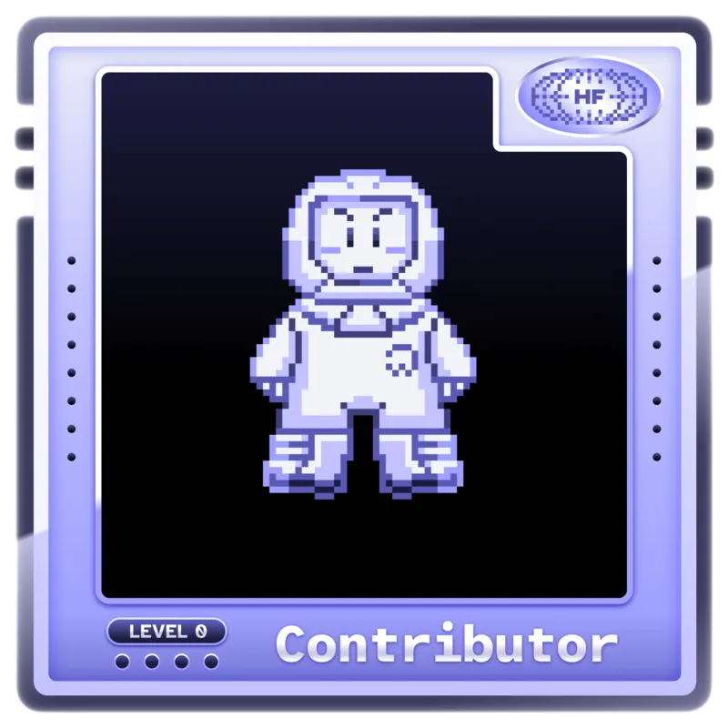
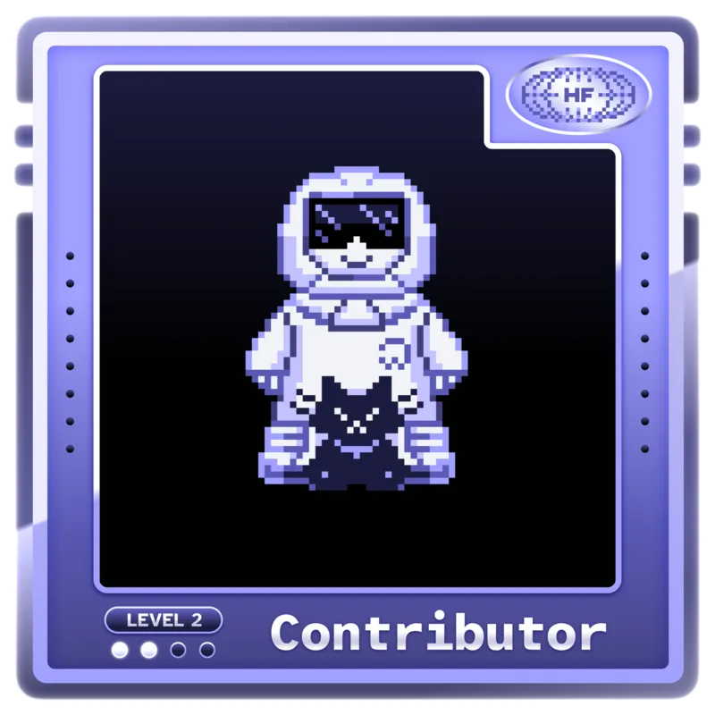
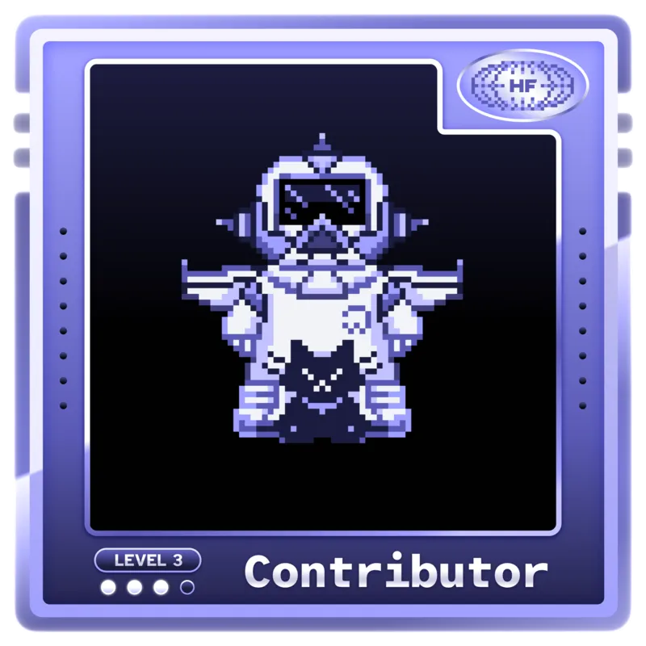
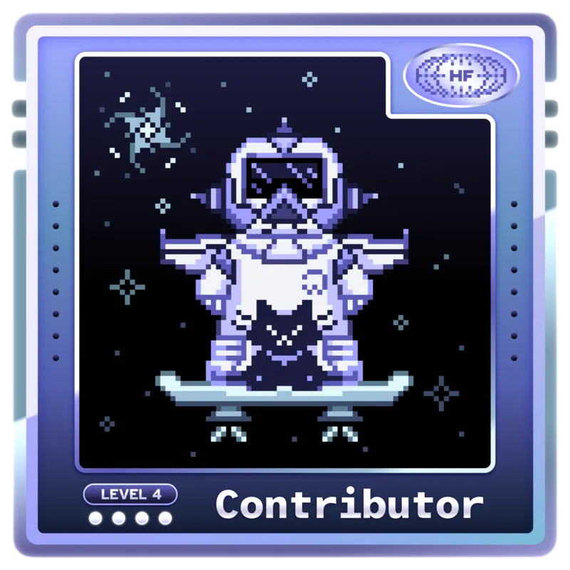
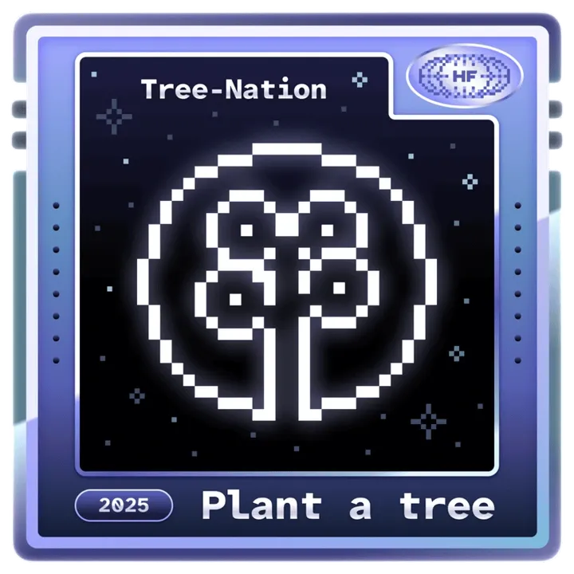
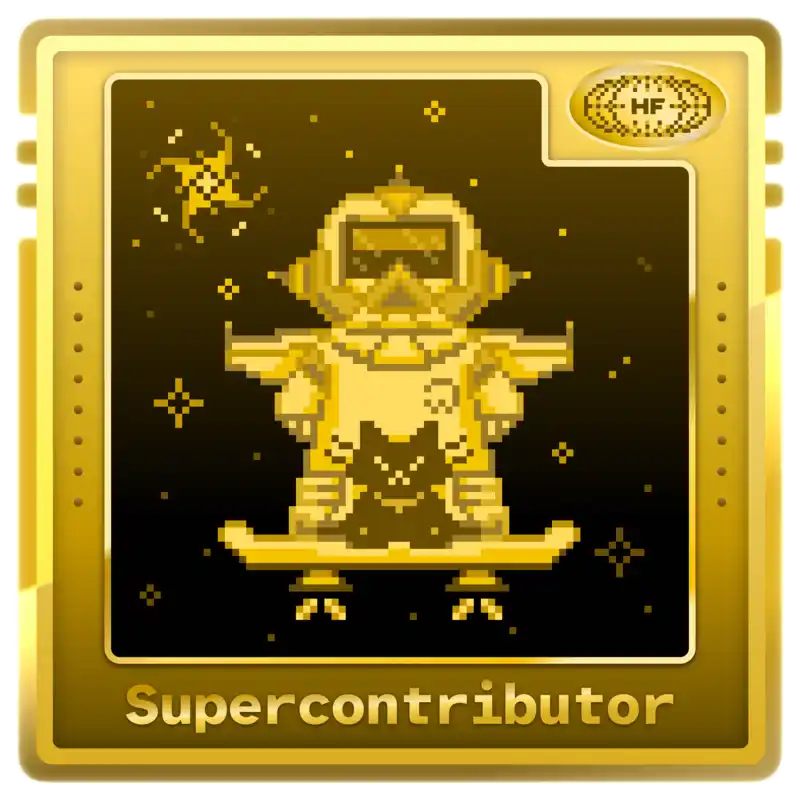

<p align="center">
  <a href="https://komarev.com/ghpvc/?username=hk2166">
    
  </a>
  &nbsp;
  
  &nbsp;
  
  &nbsp;
  
</p>

<p align="center">
  
</p>

<br/>


<!-- ==================== ABOUT ME ==================== -->
<h2 align="center"> About Me</h2>

```js
const hemant = {
  pronouns     : "he / him",
  location     : "India 🇮🇳",
  education    : "B.Tech CSE @ Newton School of Technology (2024 – 2028)",
  roles        : ["Full Stack Developer", "AI / ML Enthusiast", "Open Source Contributor"],
  currentFocus : ["Next.js & React ecosystem", "AI model deployment", "System Design"],
  superpower   : "Hacktoberfest 2024 & 2025 Super Contributor 🏆",
  askMeAbout   : ["React", "Next.js", "Node.js", "Python", "TensorFlow", "MongoDB"],
  funFact      : "Fixed a production bug at 2 AM with cold coffee & sheer willpower ☕",
  openTo       : ["collaborations", "open source projects", "internships"],
  reachMe      : "9610hemant@gmail.com",
};
```


<!-- ==================== EDUCATION ==================== -->
<h2 align="center"> Education</h2>

<p align="center">
  
</p>


<!-- ==================== WHAT I'M BUILDING ==================== -->
<h2 align="center"> Currently Building</h2>

<p align="center">
  
  &nbsp;
  
  &nbsp;
  
</p>


<!-- ==================== TECH STACK ==================== -->
<h2 align="center"> Tech Stack</h2>

<h3 align="center">Frontend</h3>
<p align="center">
  
</p>

<h3 align="center">Backend</h3>
<p align="center">
  
</p>

<h3 align="center">AI & Data Science</h3>
<p align="center">
  
</p>
<p align="center">
  
  
  
</p>

<h3 align="center">Databases & Cloud</h3>
<p align="center">
  
</p>

<h3 align="center">Tools & Platforms</h3>
<p align="center">
  
  &nbsp;
  
</p>


<!-- ==================== GITHUB TROPHIES ==================== -->
<h2 align="center"> GitHub Trophies</h2>

<p align="center">
  
</p>


<!-- ==================== GITHUB STATS ==================== -->
<h2 align="center"> GitHub Analytics</h2>

<div align="center">
  
  
</div>

<br/>

<div align="center">
  
</div>


<!-- ==================== 3D CONTRIBUTION GRAPH ==================== -->
<h2 align="center"> Contribution Graph (3D)</h2>

<p align="center">
  
</p>


<!-- ==================== SNAKE ==================== -->
<h2 align="center"> My Contributions, Being Eaten</h2>

<p align="center">
  <picture>
    <source media="(prefers-color-scheme: dark)" srcset="https://raw.githubusercontent.com/hk2166/hk2166/output/github-contribution-grid-snake-dark.svg" />
    <source media="(prefers-color-scheme: light)" srcset="https://raw.githubusercontent.com/hk2166/hk2166/output/github-contribution-grid-snake.svg" />
    
  </picture>
</p>


<!-- ==================== ACTIVITY GRAPH ==================== -->
<h2 align="center"> Activity Graph</h2>

<div align="center">
  
</div>


<!-- ==================== HACKTOBERFEST ==================== -->
<h2 align="center"> Hacktoberfest Achievements</h2>

<p align="center">
  
  &nbsp;
  
</p>

<p align="center">
  <strong>2024 Badges</strong>
</p>
<p align="center">
  
  
  
  
  
</p>

<p align="center">
  <strong>2025 Badges</strong>
</p>
<p align="center">
  
  
  
  
  
  
  
</p>


<!-- ==================== CONNECT ==================== -->
<h2 align="center">🌐 Connect with Me</h2>

<p align="center">
  <a href="https://www.linkedin.com/in/hemant9610/" target="_blank">
    
  </a>
  &nbsp;
  <a href="https://github.com/hk2166" target="_blank">
    
  </a>
  &nbsp;
  <a href="mailto:9610hemant@gmail.com" target="_blank">
    
  </a>
</p>

<br/>

<p align="center">
  <em>"Code is poetry — and I'm still writing my best stanzas."</em>
</p>

<br/>


